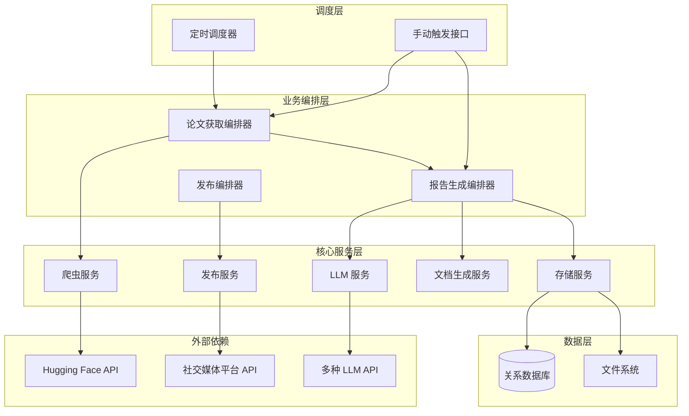
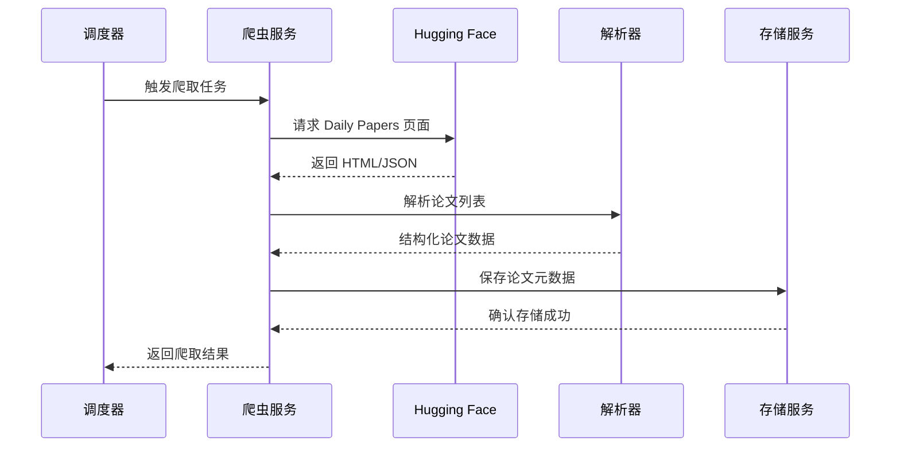
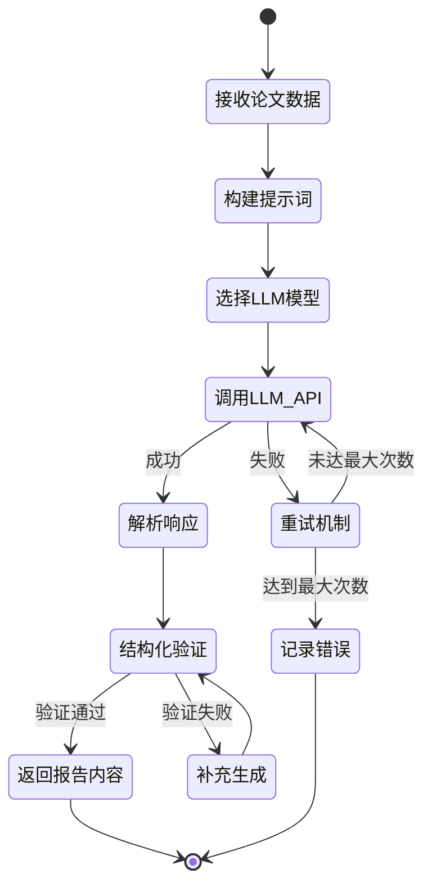
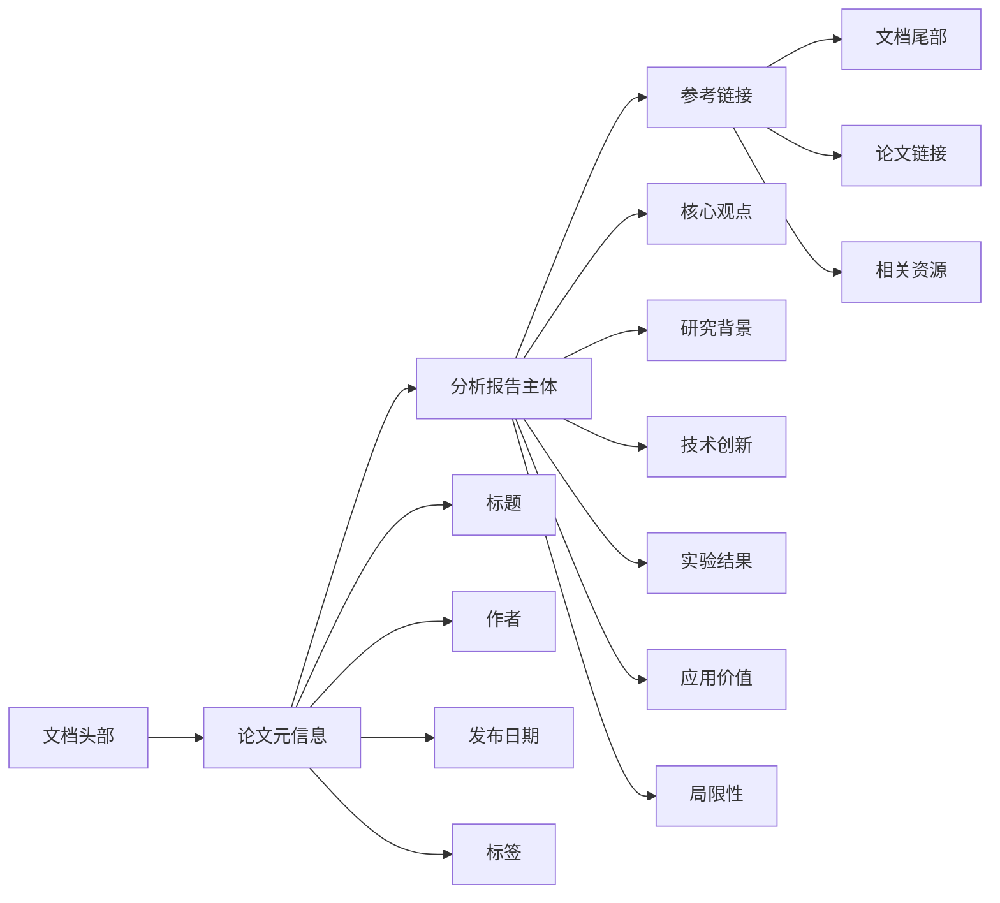
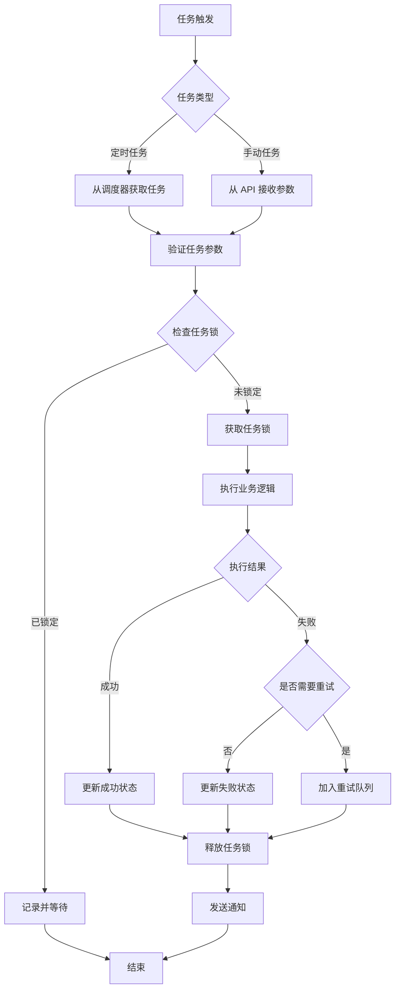
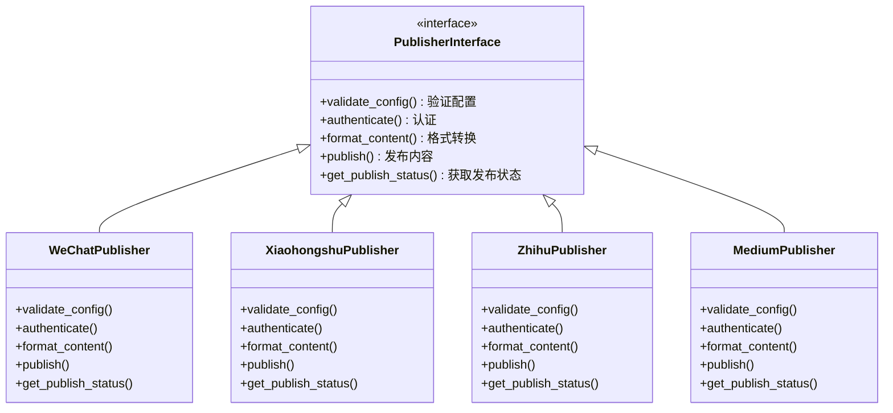
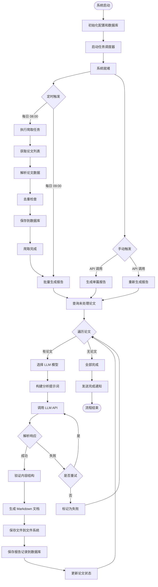

# 论文分析报告生成系统设计文档

## 一、系统概述

### 1.1 功能目标

构建一个自动化的学术论文分析系统，能够从 Hugging Face Daily Papers 等来源主动获取最新论文，利用大语言模型生成高质量的分析报告和摘要，输出为 Markdown 格式文档，并预留多平台发布能力（小红书、微信公众号、知乎、海外平台等）。

### 1.2 核心价值

- 自动化论文获取，减少手动检索时间
- 利用 AI 生成专业、结构化的论文分析报告
- 支持定时任务和手动触发两种生成模式
- 统一的内容管理，便于后续多平台分发
- 可扩展的架构，支持后续添加更多论文源和发布渠道

### 1.3 系统边界

**包含范围：**
- 论文数据爬取与解析
- 基于 LLM 的分析报告生成
- Markdown 文档生成与存储
- 定时任务调度
- 数据持久化存储
- 多平台发布接口预留

**暂不包含：**
- 前端用户界面（当前阶段）
- 实时论文推荐算法
- 用户权限管理系统

## 二、系统架构设计

### 2.1 架构风格

采用模块化分层架构，主要分为以下层次：



### 2.2 技术选型

| 技术领域 | 选型方案 | 选型理由 |
|---------|---------|---------|
| 开发语言 | Python 3.10+ | 生态丰富，适合 AI 和爬虫开发 |
| Web 框架 | FastAPI | 高性能异步框架，自动生成 API 文档 |
| 任务调度 | APScheduler | 轻量级定时任务库，支持多种触发器 |
| 爬虫框架 | httpx + BeautifulSoup4 | 异步 HTTP 客户端 + HTML 解析 |
| LLM 集成 | LangChain | 统一的 LLM 调用接口，支持多模型切换 |
| 数据库 | PostgreSQL | 成熟的关系型数据库，支持 JSON 字段 |
| ORM | SQLAlchemy | Python 主流 ORM，支持异步操作 |
| 配置管理 | Pydantic Settings | 类型安全的配置管理 |
| 日志 | structlog | 结构化日志，便于问题追踪 |

### 2.3 部署架构

系统支持单机部署和容器化部署两种方式：

- 开发阶段：本地单进程运行
- 生产阶段：Docker 容器化部署，支持水平扩展

## 三、核心模块设计

### 3.1 论文爬取模块

#### 3.1.1 职责

负责从 Hugging Face Daily Papers 及未来其他来源获取论文元数据和内容。

#### 3.1.2 数据流



#### 3.1.3 论文数据模型

| 字段名称 | 数据类型 | 说明 | 是否必填 |
|---------|---------|------|---------|
| paper_id | 字符串 | 论文唯一标识（如 arXiv ID） | 是 |
| title | 字符串 | 论文标题 | 是 |
| authors | 字符串列表 | 作者列表 | 是 |
| abstract | 文本 | 论文摘要 | 是 |
| publication_date | 日期 | 发布日期 | 是 |
| source | 枚举 | 来源（HUGGINGFACE, ARXIV 等） | 是 |
| pdf_url | URL | PDF 下载链接 | 否 |
| categories | 字符串列表 | 论文分类标签 | 否 |
| raw_data | JSON | 原始数据备份 | 是 |
| crawl_time | 时间戳 | 爬取时间 | 是 |
| status | 枚举 | 处理状态（NEW, PROCESSING, COMPLETED, FAILED） | 是 |

#### 3.1.4 爬取策略

- **增量爬取**：仅获取数据库中不存在的新论文
- **去重机制**：基于 paper_id 进行唯一性校验
- **失败重试**：网络请求失败时采用指数退避重试策略（最多 3 次）
- **速率限制**：遵守目标网站的 robots.txt 和访问频率限制

### 3.2 LLM 分析服务模块

#### 3.2.1 职责

调用大语言模型对论文进行深度分析，生成结构化报告内容。

#### 3.2.2 LLM 配置管理

支持多种 LLM 提供商的统一配置和切换：

| 配置项 | 说明 | 示例值 |
|-------|------|--------|
| provider | LLM 提供商 | openai, qwen, zhipu, kimi, local |
| model_name | 具体模型名称 | gpt-4, qwen-max, glm-4 |
| api_key | API 密钥 | 环境变量引用 |
| api_base | API 端点（可选） | 自定义 API 地址 |
| temperature | 生成温度 | 0.7 |
| max_tokens | 最大生成长度 | 4000 |
| timeout | 请求超时时间（秒） | 60 |

#### 3.2.3 分析报告生成流程



#### 3.2.4 提示词模板设计

系统使用模板化的提示词，包含以下组成部分：

- **角色定义**：定义 AI 作为学术分析专家的角色
- **任务描述**：明确分析任务的目标和要求
- **输入数据**：论文标题、作者、摘要等结构化数据
- **输出格式**：要求生成的报告结构和字段
- **质量要求**：专业性、准确性、可读性等标准

#### 3.2.5 报告内容结构

生成的分析报告包含以下标准化结构：

| 部分名称 | 说明 | 字数要求 |
|---------|------|---------|
| 核心观点总结 | 用 1-2 句话概括论文最重要的贡献 | 50-100 字 |
| 研究背景 | 论文解决的问题及研究动机 | 100-200 字 |
| 技术创新点 | 论文提出的新方法、新技术 | 200-300 字 |
| 实验与结果 | 主要实验设置和关键结果 | 150-250 字 |
| 应用价值 | 研究的实际应用场景和意义 | 100-150 字 |
| 局限性分析 | 论文的不足和未来改进方向 | 100-150 字 |
| 推荐阅读人群 | 适合哪些领域的研究者或从业者 | 50 字以内 |

### 3.3 文档生成模块

#### 3.3.1 职责

将 LLM 生成的分析内容转换为格式化的 Markdown 文档。

#### 3.3.2 Markdown 模板结构



#### 3.3.3 文件命名规范

- **格式**：`{日期}_{论文ID简化}_{主题关键词}.md`
- **示例**：`20250118_2401.12345_multimodal_learning.md`
- **存储路径**：`/data/reports/{年份}/{月份}/`

#### 3.3.4 元数据管理

每个生成的文档包含 YAML Front Matter，用于后续发布和管理：

| 元数据字段 | 说明 |
|-----------|------|
| title | 报告标题 |
| date | 生成日期 |
| paper_id | 关联的论文 ID |
| tags | 标签列表 |
| author | 报告生成者（系统标识） |
| llm_model | 使用的 LLM 模型 |
| publish_status | 发布状态 |

### 3.4 任务调度模块

#### 3.4.1 职责

管理定时任务和手动触发的任务执行。

#### 3.4.2 调度任务类型

| 任务类型 | 触发方式 | 执行频率 | 说明 |
|---------|---------|---------|------|
| 每日论文爬取 | 定时触发 | 每日 08:00 | 从 Hugging Face 获取最新论文 |
| 批量报告生成 | 定时触发 | 每日 09:00 | 对未处理的论文生成分析报告 |
| 单篇报告生成 | 手动触发 | 按需执行 | 为指定论文生成报告 |
| 重新生成报告 | 手动触发 | 按需执行 | 重新生成已有报告（例如切换 LLM） |
| 数据清理 | 定时触发 | 每周日 02:00 | 清理过期临时数据 |

#### 3.4.3 任务执行流程



#### 3.4.4 任务并发控制

- **任务锁机制**：防止同一任务重复执行
- **资源限制**：限制同时执行的 LLM 调用数量（考虑 API 配额）
- **优先级队列**：手动触发任务优先于定时任务

### 3.5 存储服务模块

#### 3.5.1 数据存储策略

采用混合存储策略：

| 数据类型 | 存储方式 | 存储位置 | 保留策略 |
|---------|---------|---------|---------|
| 论文元数据 | 关系数据库 | PostgreSQL | 永久保留 |
| 生成的报告记录 | 关系数据库 | PostgreSQL | 永久保留 |
| Markdown 文档 | 文件系统 | 本地目录或对象存储 | 永久保留 |
| 任务执行日志 | 关系数据库 | PostgreSQL | 保留 90 天 |
| 临时数据 | 文件系统 | 临时目录 | 任务完成后删除 |

#### 3.5.2 数据库表设计

**papers 表（论文表）**

| 字段 | 类型 | 约束 | 说明 |
|------|------|------|------|
| id | 整数 | 主键，自增 | 内部 ID |
| paper_id | 字符串(100) | 唯一索引 | 论文唯一标识 |
| title | 字符串(500) | 非空 | 论文标题 |
| authors | JSON | 非空 | 作者列表 |
| abstract | 文本 | 非空 | 摘要 |
| publication_date | 日期 | 可空 | 发布日期 |
| source | 字符串(50) | 非空 | 来源 |
| pdf_url | 字符串(500) | 可空 | PDF 链接 |
| categories | JSON | 可空 | 分类标签 |
| raw_data | JSON | 非空 | 原始数据 |
| crawl_time | 时间戳 | 非空 | 爬取时间 |
| status | 字符串(20) | 非空 | 状态 |
| created_at | 时间戳 | 自动生成 | 创建时间 |
| updated_at | 时间戳 | 自动更新 | 更新时间 |

**reports 表（报告表）**

| 字段 | 类型 | 约束 | 说明 |
|------|------|------|------|
| id | 整数 | 主键，自增 | 内部 ID |
| paper_id | 整数 | 外键 | 关联论文 ID |
| llm_provider | 字符串(50) | 非空 | LLM 提供商 |
| llm_model | 字符串(100) | 非空 | 使用的模型 |
| report_content | JSON | 非空 | 结构化报告内容 |
| markdown_path | 字符串(500) | 非空 | Markdown 文件路径 |
| generation_time | 整数 | 可空 | 生成耗时（秒） |
| token_usage | JSON | 可空 | Token 使用统计 |
| status | 字符串(20) | 非空 | 状态 |
| error_message | 文本 | 可空 | 错误信息 |
| created_at | 时间戳 | 自动生成 | 创建时间 |
| updated_at | 时间戳 | 自动更新 | 更新时间 |

**tasks 表（任务表）**

| 字段 | 类型 | 约束 | 说明 |
|------|------|------|------|
| id | 整数 | 主键，自增 | 任务 ID |
| task_type | 字符串(50) | 非空 | 任务类型 |
| task_params | JSON | 可空 | 任务参数 |
| status | 字符串(20) | 非空 | 执行状态 |
| trigger_type | 字符串(20) | 非空 | 触发方式（SCHEDULED/MANUAL） |
| start_time | 时间戳 | 可空 | 开始时间 |
| end_time | 时间戳 | 可空 | 结束时间 |
| result_summary | JSON | 可空 | 执行结果摘要 |
| error_message | 文本 | 可空 | 错误信息 |
| retry_count | 整数 | 默认 0 | 重试次数 |
| created_at | 时间戳 | 自动生成 | 创建时间 |
| updated_at | 时间戳 | 自动更新 | 更新时间 |

#### 3.5.3 文件系统组织

```
/data/
├── reports/                    # 生成的报告文档
│   ├── 2025/
│   │   ├── 01/
│   │   │   ├── 20250118_xxx.md
│   │   │   └── 20250119_xxx.md
│   │   └── 02/
│   └── archive/                # 归档的历史报告
├── temp/                       # 临时文件
│   └── downloads/              # 临时下载的 PDF
└── logs/                       # 日志文件
    ├── app.log
    └── error.log
```

### 3.6 发布服务模块（预留设计）

#### 3.6.1 设计目标

为未来的多平台发布功能预留统一的接口和扩展点。

#### 3.6.2 发布平台抽象



#### 3.6.3 平台适配要点

| 平台 | 内容格式转换需求 | 认证方式 | 特殊限制 |
|------|----------------|---------|---------|
| 微信公众号 | Markdown → 微信富文本 | 公众号 AppID/Secret | 需要审核，每日发布限制 |
| 小红书 | Markdown → 图文混排 | OAuth 2.0 | 内容需符合社区规范 |
| 知乎 | Markdown 原生支持 | OAuth 2.0 | 标题和标签限制 |
| Medium | Markdown 原生支持 | API Token | 发布频率限制 |

#### 3.6.4 发布记录管理

**publish_records 表（发布记录表）**

| 字段 | 类型 | 说明 |
|------|------|------|
| id | 整数 | 主键 |
| report_id | 整数 | 关联报告 ID |
| platform | 字符串 | 发布平台 |
| platform_article_id | 字符串 | 平台文章 ID |
| publish_time | 时间戳 | 发布时间 |
| status | 字符串 | 发布状态（PENDING/SUCCESS/FAILED） |
| view_count | 整数 | 阅读量（定期同步） |
| metadata | JSON | 平台特定的元数据 |

## 四、关键流程设计

### 4.1 完整工作流



### 4.2 错误处理策略

#### 4.2.1 错误分类与处理

| 错误类型 | 典型场景 | 处理策略 | 是否重试 |
|---------|---------|---------|---------|
| 网络错误 | 爬虫请求超时、API 调用失败 | 指数退避重试，最多 3 次 | 是 |
| 认证错误 | API Key 无效、权限不足 | 记录错误，发送告警，停止任务 | 否 |
| 数据解析错误 | 返回格式异常、字段缺失 | 降级处理或跳过该条数据 | 否 |
| 资源限制错误 | API 配额耗尽、磁盘空间不足 | 暂停任务，等待资源恢复 | 是（延迟） |
| LLM 内容错误 | 生成内容不符合要求 | 调整提示词重试，最多 2 次 | 是 |
| 数据库错误 | 连接失败、死锁 | 事务回滚，重试 | 是 |

#### 4.2.2 降级方案

- **LLM 服务不可用**：切换到备用 LLM 提供商
- **爬虫被封禁**：启用代理或降低请求频率
- **存储空间不足**：触发归档流程，清理临时文件

### 4.3 监控与日志

#### 4.3.1 日志级别与内容

| 日志级别 | 记录场景 | 示例内容 |
|---------|---------|---------|
| DEBUG | 调试信息、详细流程 | 请求参数、响应详情 |
| INFO | 正常业务流程 | 任务开始、任务完成、论文数量 |
| WARNING | 可恢复的异常 | 重试操作、降级处理 |
| ERROR | 业务错误 | 单篇论文处理失败、API 调用失败 |
| CRITICAL | 系统级故障 | 数据库连接失败、配置错误 |

#### 4.3.2 关键监控指标

| 指标类别 | 具体指标 | 监控目的 |
|---------|---------|---------|
| 业务指标 | 每日爬取论文数量 | 确保数据源正常 |
| 业务指标 | 报告生成成功率 | 评估系统稳定性 |
| 性能指标 | LLM 调用平均耗时 | 优化生成效率 |
| 性能指标 | 单篇报告生成耗时 | 性能基线监控 |
| 资源指标 | LLM Token 消耗量 | 成本控制 |
| 资源指标 | 数据库存储增长 | 容量规划 |
| 错误指标 | 任务失败率 | 问题预警 |
| 错误指标 | API 错误率 | 外部依赖健康度 |

## 五、配置管理设计

### 5.1 配置文件结构

系统配置采用分层配置方式，支持环境变量覆盖：


### 5.2 核心配置项

**应用配置**

| 配置项 | 说明 | 默认值 |
|-------|------|--------|
| app.name | 应用名称 | AutoScholar |
| app.version | 应用版本 | 读取版本文件 |
| app.env | 运行环境 | development |
| app.debug | 调试模式 | false |

**数据库配置**

| 配置项 | 说明 | 示例值 |
|-------|------|--------|
| database.host | 数据库主机 | localhost |
| database.port | 端口 | 5432 |
| database.name | 数据库名 | autoscholar |
| database.user | 用户名 | 从环境变量读取 |
| database.password | 密码 | 从环境变量读取 |
| database.pool_size | 连接池大小 | 10 |

**爬虫配置**

| 配置项 | 说明 | 默认值 |
|-------|------|--------|
| crawler.user_agent | User-Agent | 自定义标识 |
| crawler.timeout | 请求超时（秒） | 30 |
| crawler.max_retries | 最大重试次数 | 3 |
| crawler.retry_delay | 重试延迟（秒） | 5 |
| crawler.concurrent_limit | 并发限制 | 3 |

**LLM 配置**

| 配置项 | 说明 | 示例值 |
|-------|------|--------|
| llm.default_provider | 默认提供商 | openai |
| llm.fallback_provider | 备用提供商 | qwen |
| llm.providers.{name}.api_key | API 密钥 | 从环境变量读取 |
| llm.providers.{name}.model | 模型名称 | gpt-4 |
| llm.providers.{name}.temperature | 生成温度 | 0.7 |
| llm.providers.{name}.max_tokens | 最大 Token | 4000 |

**调度配置**

| 配置项 | 说明 | 默认值 |
|-------|------|--------|
| scheduler.crawl_cron | 爬取任务 Cron 表达式 | 0 8 * * * |
| scheduler.generate_cron | 生成任务 Cron 表达式 | 0 9 * * * |
| scheduler.cleanup_cron | 清理任务 Cron 表达式 | 0 2 * * 0 |
| scheduler.timezone | 时区 | Asia/Shanghai |

**存储配置**

| 配置项 | 说明 | 默认值 |
|-------|------|--------|
| storage.reports_path | 报告存储路径 | /data/reports |
| storage.temp_path | 临时文件路径 | /data/temp |
| storage.log_path | 日志路径 | /data/logs |
| storage.log_retention_days | 日志保留天数 | 90 |

## 六、扩展性设计

### 6.1 论文源扩展

系统设计支持未来添加更多论文来源，扩展方式：

1. 实现统一的爬虫接口
2. 配置新的论文源参数
3. 注册到爬虫工厂
4. 通过配置文件启用

**未来可扩展的论文源：**
- arXiv 官方 API
- Google Scholar
- PubMed
- CVPR/NeurIPS 等会议官网
- Semantic Scholar API

### 6.2 LLM 提供商扩展

通过 LangChain 的抽象层，可以轻松集成新的 LLM 提供商：

- 添加提供商配置
- 实现 LangChain 兼容的调用适配器
- 在配置中启用新提供商

### 6.3 发布平台扩展

发布模块采用插件化设计，扩展新平台的步骤：

1. 实现统一的发布接口
2. 开发平台特定的内容转换逻辑
3. 配置平台认证信息
4. 注册到发布服务

### 6.4 报告模板扩展

支持定义多种报告生成模板：

- 学术风格模板（详细技术分析）
- 科普风格模板（面向大众）
- 速览模板（快速浏览版本）
- 多语言模板（中英文版本）

通过配置或 API 参数选择使用的模板。

## 七、安全性设计

### 7.1 敏感信息保护

- **API 密钥管理**：所有 API 密钥通过环境变量配置，不入库、不记录日志
- **数据库凭证**：使用环境变量或密钥管理服务
- **日志脱敏**：自动过滤日志中的敏感字段（如 token、password）

### 7.2 访问控制

- **API 接口**：支持 API Key 认证（手动触发任务时使用）
- **内部服务**：通过网络隔离保护，仅内网访问
- **数据库访问**：最小权限原则，应用账号仅授予必要权限

### 7.3 数据安全

- **备份策略**：数据库每日自动备份，保留最近 30 天
- **事务保证**：关键操作使用数据库事务，确保数据一致性
- **输入验证**：对外部输入（论文数据、API 参数）进行严格验证

## 八、性能优化考虑

### 8.1 并发处理

- **异步 I/O**：爬虫和 API 调用使用异步方式，提升并发能力
- **批量处理**：数据库操作尽量使用批量插入/更新
- **连接池**：数据库和 HTTP 客户端使用连接池管理

### 8.2 缓存策略

- **论文去重缓存**：使用内存缓存已处理的 paper_id，减少数据库查询
- **配置缓存**：系统配置加载后缓存，避免重复读取
- **LLM 响应缓存**（可选）：对相同输入缓存 LLM 响应，降低成本

### 8.3 资源限制

- **LLM 调用限流**：控制单位时间内的 API 调用次数，避免超出配额
- **内存管理**：大文件处理采用流式方式，避免内存溢出
- **磁盘空间监控**：定期检查磁盘使用率，触发清理或告警

## 九、部署方案

### 9.1 环境依赖

| 组件 | 版本要求 | 说明 |
|------|---------|------|
| Python | 3.10+ | 运行环境 |
| PostgreSQL | 13+ | 数据库 |
| 操作系统 | Linux/macOS | 推荐 Ubuntu 20.04+ |
| 磁盘空间 | 50GB+ | 存储报告和数据库 |
| 内存 | 4GB+ | 基础运行需求 |

### 9.2 部署步骤

1. **环境准备**
   - 安装 Python 和依赖库
   - 安装并配置 PostgreSQL
   - 创建必要的目录结构

2. **数据库初始化**
   - 创建数据库和用户
   - 执行数据库迁移脚本
   - 创建索引

3. **配置文件**
   - 复制配置模板
   - 填写数据库连接信息
   - 配置 LLM API 密钥

4. **启动服务**
   - 启动应用主进程
   - 验证调度器正常运行
   - 测试手动触发接口

5. **监控配置**
   - 配置日志轮转
   - 设置告警规则
   - 验证备份任务

### 9.3 容器化部署（可选）

未来可通过 Docker 容器化部署：

- 应用容器：包含 Python 运行环境和代码
- 数据库容器：PostgreSQL 独立容器
- 数据卷：持久化存储报告文件和数据库数据
- 网络：容器间内部网络通信

## 十、测试策略

### 10.1 测试层次

| 测试类型 | 测试目标 | 覆盖重点 |
|---------|---------|---------|
| 单元测试 | 独立函数和方法 | 工具函数、数据解析、格式转换 |
| 集成测试 | 模块间协作 | 爬虫→存储、LLM→文档生成 |
| 端到端测试 | 完整业务流程 | 从爬取到报告生成的全流程 |
| 性能测试 | 系统性能指标 | 并发处理能力、响应时间 |

### 10.2 测试数据准备

- **Mock 数据**：模拟 Hugging Face API 响应
- **测试 LLM**：使用成本较低的模型进行测试
- **测试数据库**：独立的测试数据库环境

### 10.3 质量保证

- 代码覆盖率目标：70% 以上
- 关键路径必须有端到端测试
- 错误处理逻辑必须有专项测试

## 十一、项目实施计划

### 11.1 阶段划分

**第一阶段：核心功能开发（优先级：高）**
- 数据库设计与初始化
- Hugging Face 爬虫实现
- LLM 集成与报告生成
- Markdown 文档生成
- 基础任务调度

**第二阶段：稳定性增强（优先级：高）**
- 错误处理与重试机制
- 日志与监控
- 配置管理优化
- 单元测试编写

**第三阶段：功能扩展（优先级：中）**
- 手动触发 API 接口
- 多 LLM 提供商切换
- 报告模板优化
- 性能优化

**第四阶段：发布功能（优先级：低）**
- 发布服务框架
- 微信公众号适配
- 小红书、知乎适配
- 海外平台适配

### 11.2 技术风险与应对

| 风险项 | 风险等级 | 应对措施 |
|-------|---------|---------|
| LLM API 稳定性 | 中 | 实现多提供商切换和重试机制 |
| 爬虫反爬虫限制 | 中 | 降低请求频率，使用官方 API |
| LLM 生成质量 | 中 | 优化提示词，支持人工审核 |
| API 成本超预算 | 低 | 设置日配额限制，监控用量 |
| 平台发布限制 | 低 | 预研平台政策，做好降级方案 |

## 十二、后续优化方向

### 12.1 功能增强

- **个性化推荐**：基于用户兴趣推荐论文
- **多语言支持**：生成中英文双语报告
- **图表生成**：自动生成论文核心图表解读
- **语音播报**：将报告转换为语音内容

### 12.2 技术升级

- **分布式任务队列**：使用 Celery 实现更强大的任务调度
- **向量数据库**：引入向量检索，支持语义搜索
- **流式生成**：支持 LLM 流式输出，提升用户体验
- **云原生部署**：支持 Kubernetes 编排

### 12.3 用户界面

- **Web 管理后台**：可视化管理论文和报告
- **订阅功能**：用户订阅特定领域的论文
- **统计分析**：报告阅读数据分析和可视化
